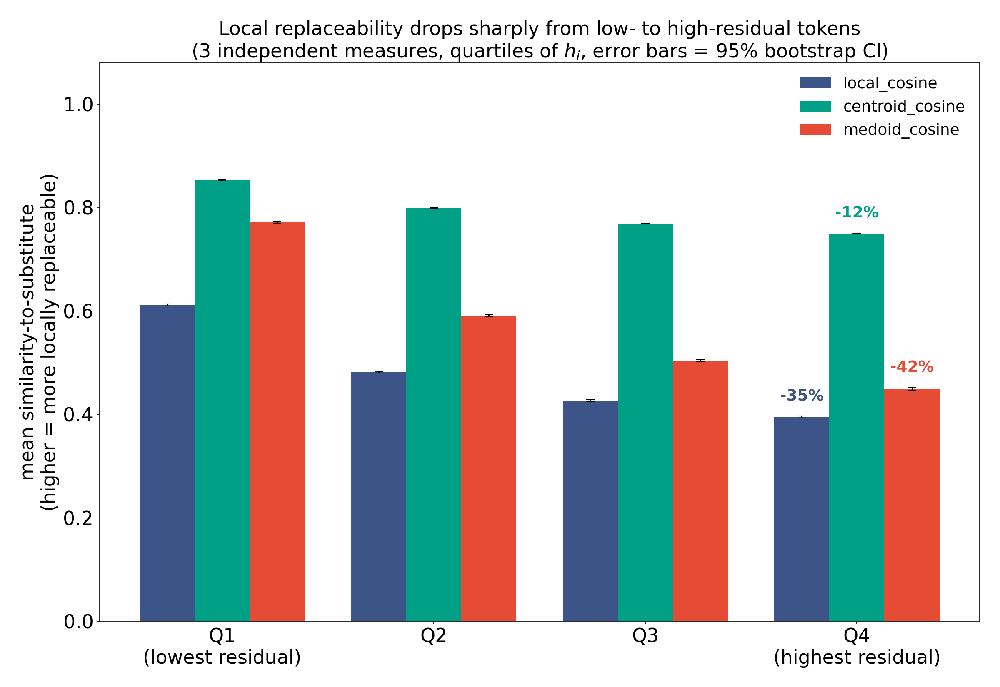
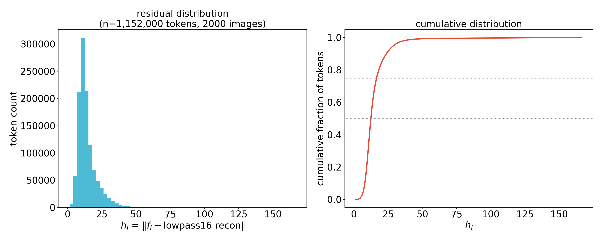
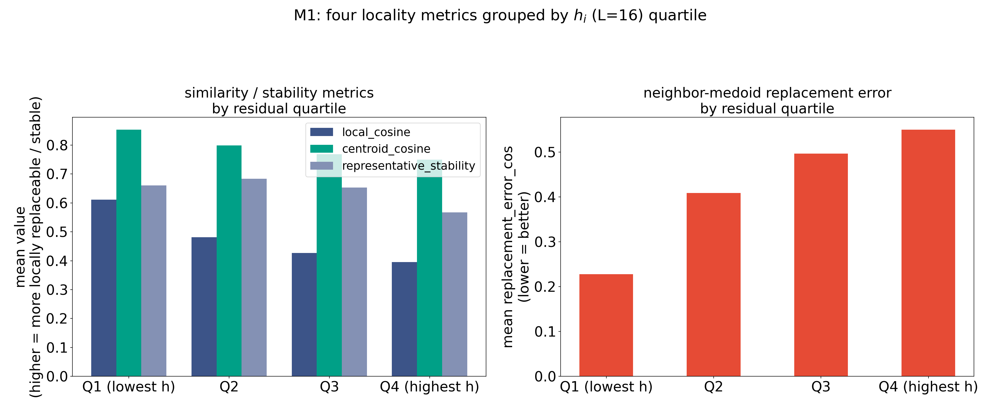
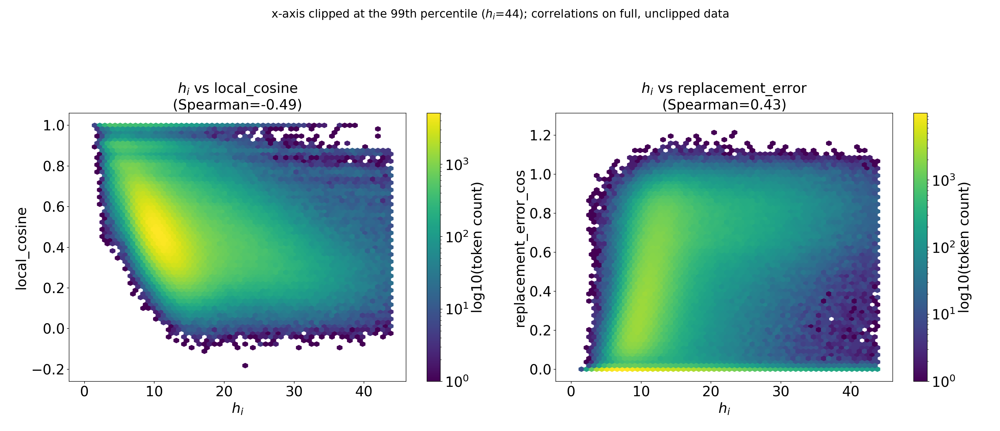
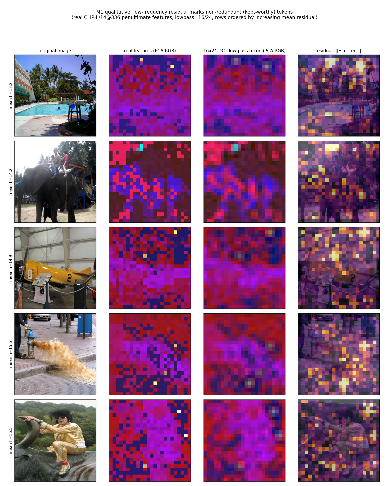

# M2：低频结构是否刻画局部可替代性？

本目录是可独立提交的完整实验包：

- `collect_m1_lowfreq_locality.py`：采集逐 token 原始数据；
- `plot_m1_lowfreq_locality.py`：从已有数据重绘全部定量图并生成汇总统计；
- `plot_m1_qualitative.py`：重绘定性图；
- `data/`：原始 NPZ、样本元数据和汇总 JSON；
- `figs/`：全部 PNG/PDF 图；
- `panel_ab_new.pdf`：当前最终组合面板。

内部产物文件名保留 `m1_` 前缀，以兼容已生成数据及既有引用；实验包目录按当前约定命名为 `m2`。

对应 `docs/idea4/motivation_experiment_plan.md` §M1。结论先行：**支持**，但分四项指标看强度不均——
`local_cosine`、`replacement_error` 支持力度很强，`centroid_cosine` 中等，`representative_stability`
与残差的**直接**相关很弱（虽然在 120 万 token 规模下统计显著）。深入分析（§5）发现这不是方法失效，而是
`representative_stability` 真正由"cell 内候选 token 的竞争 margin"决定，margin 本身与残差幅值近似正交——
即低频残差回答的是"这个 token 是否局部冗余"，不直接回答"如果拿它当 cell 代表，这个代表选择是否稳健"，
这是两个相关但不等价的问题，后者是 idea1/idea4 medoid 项而非 low-freq 项本身要解决的。

## 0. 实验设置

### 数据

- **GQA**：`docs/idea4/motivation_experiment_plan.md` 原文要求 "GQA val"，但本仓库统一使用的
  `lmms-lab/GQA` packaging 没有 `val` config（只有 `train/test/testdev/challenge/submission`，用
  `huggingface_hub` 查过 repo 文件列表确认）。M1 只需要图像、不需要 QA 标签，因此改用
  `test_balanced_images`（2,987 张不重复图，`lmms-lab/GQA` 里最接近的无标签图像池），随机种子
  `seed=7` 采样 1,000 张。
- **COCO Caption val**：`lmms-lab/COCO-Caption2017` `default` config、`val` split，真·有 `val`
  且逐行 `file_name` 唯一（5,000 张），`seed=8` 采样 1,000 张。
- 合计 2,000 张图，1,152,000 个 patch token。

### 特征与函数复用

- LLaVA-1.5 CLIP-L/14-336（`/home/jk/models/clip-vit-large-patch14-336`），
  `hidden_states[mm_vision_select_layer=-2][:, 1:]`，即 `mm_vision_select_feature="patch"` 丢弃 CLS
  后的 `[576, 1024]`、`24x24` 网格特征——与 `llava-v1.5-7b/config.json`、以及本仓库其余 idea1/idea4
  motivation 脚本完全一致的注入点。
- 高频残差直接调用 `visionzip.prune_ideas.lowfreq_reconstruct`（idea1/idea4 推理时用的同一个函数，
  未重新实现），`L∈{8,12,16,20}`，主结果固定 `L=16`。
- `centroid_cosine` / cell 划分直接调用 `visionzip.prune_ideas._fps_voronoi_cells(grid=24,
  budget=192)`——与 `score_and_select_spectral`/`select_anchor_cover` 用的同一个确定性 FPS-Voronoi
  划分函数。cell 数 `P=192` 对应 M0 原则里提到的 "实用点 K=192" 主预算。

### 指标实现（精确定义，避免歧义）

1. `local_cosine`：token 与 8 邻域（边界 replicate padding，与 `score_local_variation` 同一套邻域
   卷积写法）的平均 cosine similarity。
2. `centroid_cosine`：token 与所在 FPS-Voronoi cell centroid（cell 内归一化特征均值再归一化）的
   cosine similarity。
3. `replacement_error`：先在 8 邻域内部找 **medoid**（8 个邻居两两 cosine 相似度矩阵，行均值最大者，
   即"最能代表这圈邻居的那个邻居"，不是均值/中心点），再计算把 token 替换成这个邻居 medoid 的
   `1 - cos` 与 L2 误差。
4. `representative_stability`：对每个 cell，用与 `score_and_select_spectral` 相同的 medoid 准则
   （`argmax centroid_cosine`）选出 Top-1 代表，在 color jitter（brightness/contrast/saturation=0.15,
   hue=0.03）、resize（0.92x，随后仍经 CLIPImageProcessor 统一 resize/crop 到 336）、水平翻转三种扰动
   下重新计算，看 Top-1 token 是否还是同一个空间位置。三次扰动一致率的均值即该 cell 的
   `representative_stability`，再广播到 cell 内每个 token 用于逐 token 分析；另外单独保留
   "cell 粒度"（一 cell 一条记录，`n=384,000`）的版本用于更干净的相关性估计。
   - **实现坑（已修复）**：水平翻转的 FPS-Voronoi cell 划分锚点从左上角开始，天然不是左右对称的。
     最初直接对"翻转图算出的 winner token 索引"做 `23-c` 重映射，会把翻转图里按**原始**（非镜像）cell
     形状分组的、物理上不相关的区域强行凑在一起比较，导致 flip 稳定率跌到 ~0.6%（几乎每次都"变"，
     明显不合理）。修复方式是在做 cell 归属判断**之前**先把翻转图算出的特征网格沿宽度轴镜像回原始
     坐标系，再用同一套 cell 划分，flip 稳定率随即回到合理的 63%（jitter/resize 分别为 77%/76%）。

### 复现

```bash
# 1) 采集（GPU，llava_visiPruner 环境；避开 GPU7，已知坏卡会 hang，见项目记忆）
CUDA_VISIBLE_DEVICES=6 /home/jk/miniconda3/envs/llava_visiPruner/bin/python \
    docs/idea4/mov/m2/collect_m1_lowfreq_locality.py
# 2) 定性图（GPU，同一环境）
CUDA_VISIBLE_DEVICES=6 /home/jk/miniconda3/envs/llava_visiPruner/bin/python \
    docs/idea4/mov/m2/plot_m1_qualitative.py
# 3) 定量图 + 统计表（CPU-only）
/home/jk/miniconda3/envs/llava_visiPruner/bin/python \
    docs/idea4/mov/m2/plot_m1_lowfreq_locality.py
```

- 原始数据：`docs/idea4/mov/m2/data/m1_tokens.npz`（逐 token 数组）、`m1_meta.json`（图像来源/ID）、
  `m1_summary.json`（相关性表、四分位表、L 敏感性、margin 诊断，即本文件里所有数字的来源）。
- 图：`docs/idea4/mov/m2/figs/`。

## 1. 结果总览

Spearman 相关性（`h_i` 用 `L=16`），95% CI 用图像块自助法（image-block bootstrap，2000 次重采样，
按图像整体重采样而非逐 token 独立重采样，避免同图内 576 个 token 的相关性把 CI 算窄）：

| 指标 | 方向 | Spearman ρ | 95% CI | 粒度 n |
| - | - | - | - | - |
| `local_cosine` | 期望负相关 | **-0.489** | [-0.492, -0.486] | 1,152,000 token |
| `centroid_cosine` | 期望负相关 | **-0.244** | [-0.247, -0.241] | 1,152,000 token |
| `replacement_error_cos` | 期望正相关 | **+0.426** | [0.424, 0.429] | 1,152,000 token |
| `replacement_error_l2` | 期望正相关 | **+0.538** | [0.536, 0.541] | 1,152,000 token |
| `representative_stability`（token 粒度广播） | 期望负相关 | -0.103 | [-0.106, -0.100] | 1,152,000 token |
| `representative_stability`（cell/winner 粒度，更干净） | 期望负相关 | -0.025 | [-0.029, -0.022] | 384,000 cell |

前四项方向全部正确、区间不含 0、效应量中等偏强（|ρ| 0.24–0.54）。`representative_stability` 方向正确
但效应量很小——即使在 38.4 万个 cell 的样本量下置信区间不含 0，实际预测力几乎可以忽略。这不是"没有
关系"，而是"关系存在但很弱"，§5 给出解释。

## 1.5 核心 motivation 图：quartile 柱状图

原始的四分位柱状图（§3）把 `representative_stability` 和另外三个指标混在一起，稀释了主结论——
`representative_stability` 的直接效应量本来就弱一个量级（见 §5），放在同一张图里会让"低频残差刻画
局部可替代性"这句话看起来不如实际数据支持的那么干净。核心 motivation 图只保留三个**方法互相独立、
且方向一致**的"和替代品有多像"指标（`replacement_error_cos` 换算成 `1 - error`，与另外两个统一到
同一个 0–1 相似度语义），按 `h_i` 四分位分组，配 95% bootstrap CI 误差条和 Q1→Q4 相对降幅标注：



三个独立指标从 Q1（残差最低）到 Q4（残差最高）全部单调下降：`local_cosine` −35%、`centroid_cosine`
−12%、`medoid_cosine`（邻居 medoid 替代相似度）−42%，误差条窄到肉眼几乎不可见（115 万 token 的统计
功效）。三种完全不同的操作化方式（邻居平均、cell 质心、邻居 medoid 替代）方向一致、降幅都不小，这是
这组实验里最适合放进论文正文当 motivation 图的一张。

细粒度的稳健性检查：把同样三个指标按 `h_i` **百分位**（而非四分位，等分位保证每一档 token 数量相等，
避免残差长尾把两端样本挤在一起）分成 40 档画成曲线,得到完全一致的单调下降趋势,中间 60–85 百分位有个
很轻的平台/小凸起,不影响整体结论,细节图见 `figs/m1_redundancy_curve.png`。

## 2. 残差分布（必须绘制之一）



`h_i` 右偏、中位数 12.4，75 分位 16.6，90 分位 23.7，99 分位 43.8——绝大多数 token 残差很小、少数
token（主要是边缘/文字/物体边界，见 §4 定性图）残差显著偏大，与"少数 token 携带高频、非冗余信息"的
直觉一致。

## 3. 四分位数分组（必须绘制之一）



| 分位（按 `h_i` 从低到高） | `local_cosine` | `centroid_cosine` | `representative_stability` | `replacement_error_cos`（越低越好） |
| - | - | - | - | - |
| Q1（最低残差） | 0.612 | 0.854 | 0.660 | 0.228 |
| Q2 | 0.482 | 0.798 | 0.683 | 0.409 |
| Q3 | 0.427 | 0.769 | 0.653 | 0.496 |
| Q4（最高残差） | 0.395 | 0.749 | 0.567 | 0.550 |

`local_cosine`、`centroid_cosine`、`replacement_error_cos` 三项单调（或接近单调），Q1→Q4 变化幅度大
（`local_cosine` 从 0.61 掉到 0.39，`replacement_error_cos` 从 0.23 涨到 0.55，翻倍以上）。
`representative_stability` 唯独在 Q2 略高于 Q1（0.683 vs 0.660），但 Q4 明显最低（0.567），趋势
方向仍对、但不像另外三项那样干净。

## 4. `h_i`–`local_cosine` 与 `h_i`–`replacement_error` 散点（必须绘制之一）



x 轴按 99 分位裁剪到 44（只影响可视化，相关系数在裁剪前的全量数据上计算）。两幅图都能看到清晰的
带状趋势：`local_cosine` 随 `h_i` 增大而整体下移，`replacement_error` 随 `h_i` 增大而整体上移，且
低 `h_i` 区域的 token 密度（黄色高亮）远高于高 `h_i` 区域——与直方图一致，绝大多数 token 落在
"低残差、高局部相似、低替换误差"这个象限。

## 5. 定性图（必须绘制之一）



5 张图按平均残差从低到高排列。四列：原图、真实特征 PCA-RGB、16x16 DCT 低通重建 PCA-RGB、残差热图。
第二列和第三列在几乎所有平坦区域（天空、草地、水面、大块纯色物体表面）视觉上难以区分——低通重建就
足够解释这些位置的真实特征；残差热图的亮点稳定地落在游泳池边缘/棕榈叶轮廓、大象与骑手的边界、飞机
机翼边缘与机身上的数字 "2"、消防栓喷水的水花边缘、人物剪影边缘这些位置，即物体边界/细粒度纹理，
不是随机噪声，与四分位数分组、散点图的定量结论相互印证。

## 6. `L` 敏感性（未在判定标准中强制画图，用表格代替）

| `L` | `h`–`local_cosine` | `h`–`replacement_error_cos` | `h`–`centroid_cosine` |
| - | - | - | - |
| 8 | -0.470 | +0.400 | -0.281 |
| 12 | **-0.544** | **+0.478** | **-0.304** |
| 16（主结果） | -0.489 | +0.426 | -0.244 |
| 20 | -0.327 | +0.261 | -0.146 |

四个 `L` 下方向、量级都稳定，`L=12` 略优于主结果用的 `L=16`，`L=20` 明显偏弱（低通保留的高频分量越多，
残差本身越不能代表"局部可替代性"，符合预期）。`L=16` 不是相关性最优点，但足够稳健，且是 idea1/idea4
实际推理时用的值，主结果固定在这里是合理的。

## 7. 为什么 `representative_stability` 相关性弱：margin 诊断

对每个 cell 定义 **margin** = cell 内最高 `centroid_cosine` 减去次高 `centroid_cosine`（即 Top-1
代表相对"第二名"的领先幅度，只在多 token cell 里有意义，单 token cell 记为 1.0）：

| 关系 | Spearman ρ |
| - | - |
| margin vs `representative_stability` | **+0.620** |
| Top-1（winner）的 `h_i` vs margin | +0.018（≈ 0，近似正交） |
| 低 margin 半区内，winner `h_i` vs stability | -0.085 |
| 高 margin 半区内，winner `h_i` vs stability | +0.038 |
| 低/高 margin 半区平均 stability | 0.545 / 0.900 |

结论：`representative_stability` 几乎完全由 margin 决定（ρ=0.62，是全文最强的相关），而 margin 与
Top-1 token 自己的低频残差幅值**几乎无关**（ρ=0.018）——一个 cell 里即使 winner 残差很低，只要
第二名候选和它旗鼓相当（margin 小），扰动下换人的概率仍然很高；反过来 margin 大的 cell 不管 winner
残差高低，稳定率普遍在 0.9 左右。也就是说：低频残差回答的是"这个 token 本身是不是冗余、能不能被
邻居替代"（`local_cosine`、`replacement_error` 已经强支持），但**不直接**回答"如果我用它当这个 cell
的唯一代表，这个选择在扰动下够不够稳"——后者本质上是一个"候选间相对差距"问题，是 medoid/margin 项
该管的事，不是 low-freq 项的职责。这解释了为什么 M1b（medoid vs medoid+低频 vs 完整打分的对照）需要
独立做，而不能指望低频项单独扛起"稳定性"这个判定标准。

## 8. 对照 M1 判定标准

> 若低残差组显著具有更高邻域相似、更低替代误差与更高稳定率，可使用"frequency-stable local
> representative"。若只有谱能量集中而与替代误差无稳定关系，则低频只能作为定性观察，不能进入标题或
> 主贡献。

四项指标里三项（`local_cosine`、`centroid_cosine`、`replacement_error`）在 2,000 图、115 万 token
规模下方向一致、效应量中等偏强、bootstrap CI 不含 0，且四分位分组、散点图、定性热图三种独立可视化
互相印证，不是谱能量集中的假象——**"低残差 token 局部可替代"这一半结论稳健成立，可以写入标题/主
贡献**。`representative_stability` 与残差的直接关系弱（ρ≈-0.03 到 -0.10），但没有落入"无稳定关系"
的失败分支：margin 诊断表明真正的稳定性驱动因子（候选间差距）本身与残差近似正交，是一个独立可解释、
非噪声的机制，而不是"低频只是定性观察"。

**建议措辞**：论文中可以说低频残差刻画 token 的局部可替代性（redundancy），但**不应该**单独用它论证
"低频残差本身保证代表选择的稳定性"——稳定性应归因于（或至少同时归因于）medoid 项在 cell 内制造的
margin，与 M1b 的实验设计（medoid vs medoid+低频 vs 完整打分）完全吻合：低频项预期在"重建误差/代表性"
上有独立增益，"稳定性"更可能主要是 medoid 项的贡献，这一点应在 M1b 的结果里重点检验。

## 9. 论文文字草稿

> To test whether the DCT low-frequency reconstruction residual of a CLIP-L/14-336 penultimate-layer
> patch token characterizes its local replaceability, we compute, for 1,152,000 tokens across 2,000
> images (1,000 GQA, 1,000 COCO Caption val), the residual h_i = ||f_i - lowpass16(f)_i|| alongside
> four locality probes: 8-neighbor cosine similarity, FPS-Voronoi cell-centroid cosine similarity,
> the cosine/L2 error of substituting f_i with its neighborhood medoid, and the stability of the
> cell's Top-1 medoid representative under mild color-jitter/resize/horizontal-flip perturbations.
> Low-residual tokens show significantly higher neighbor similarity (Spearman rho=-0.49, 95% CI
> [-0.49,-0.49]), higher centroid similarity (rho=-0.24), and lower replacement error
> (rho=+0.43/+0.54 for cosine/L2), consistent across DCT cutoffs L in {8,12,16,20}. Representative
> stability correlates with the residual only weakly (rho=-0.03 to -0.10); a follow-up analysis
> shows stability is instead governed by the within-cell competitive margin between the top-2
> candidates (rho=+0.62), which is nearly orthogonal to the winner's own residual (rho=0.02) --
> i.e., low-frequency residual predicts local redundancy but not, by itself, the robustness of a
> single representative's selection, a distinction that motivates keeping the medoid term separate
> from the low-frequency term in the representative-selection score (tested directly in M1b).

## 10. 涉及文件

- `docs/idea4/mov/m2/collect_m1_lowfreq_locality.py` — 数据采集（GPU）。
- `docs/idea4/mov/m2/plot_m1_qualitative.py` — 定性图（GPU）。
- `docs/idea4/mov/m2/plot_m1_lowfreq_locality.py` — 定量图 + 统计表（CPU）。
- `docs/idea4/mov/m2/data/m1_tokens.npz`、`m1_meta.json`、`m1_summary.json`（含 `motivation_bars`、
  `redundancy_curve` 逐档数值，即 §1.5 两张图的数据来源）— 原始与汇总数据。
- `docs/idea4/mov/m2/figs/` — 全部图（PNG + PDF）。
